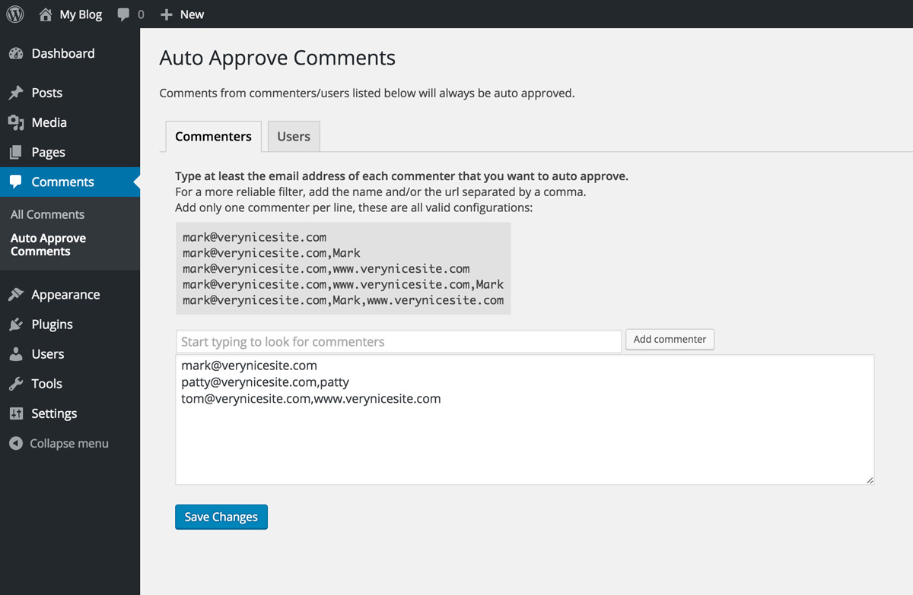
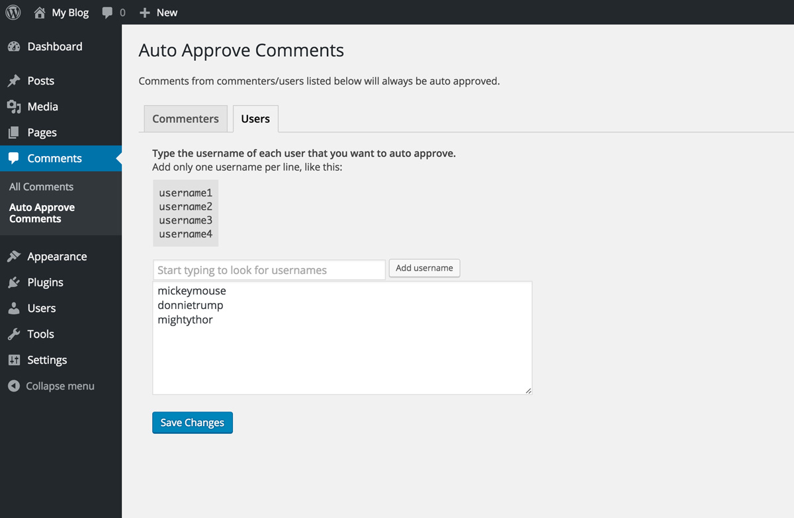

# Auto Approve Comments - WordPress Plugin

## Official URL
Download it from the WordPress plugin directory:  
https://wordpress.org/plugins/auto-approve-comments/


## Description
Auto Approve Comments allows you to create a white list of commenters and to automatically approve their comments after checking their email/name/URL or username.  
  
Useful when you set your comments to be manually approved to avoid spam, but you still want to immediately approve the comments made by your most trustful readers.

## Installation
Upload the zip file on your WordPress website and activate the plugin.

## Usage
* Open Comments -> Auto Approve Comments
* Configure the "Commenter list" or the "Users list" (see some examples below)
* Save and you're done

From now on all the commenters listed in one of the lists above will have their comments immediately approved even if you set the comments to be manually approved.

## Valid configurations

### Commenters list
Add only one commenter per line, these are all valid configurations:  
```
mark@verynicesite.com  
mark@verynicesite.com,Mark  
mark@verynicesite.com,www.verynicesite.com  
mark@verynicesite.com,www.verynicesite.com,Mark  
mark@verynicesite.com,Mark,www.verynicesite.com 
```

### Users list
Add only one username per line:  
```
username1
username2
username3
username4
```

## Interface screenshots

### Commenters list tab  


### Users list tab  



## License
The Auto Approve Comments plugin is licensed under the GPL v2 or later:  
http://www.gnu.org/licenses/gpl-2.0.html

