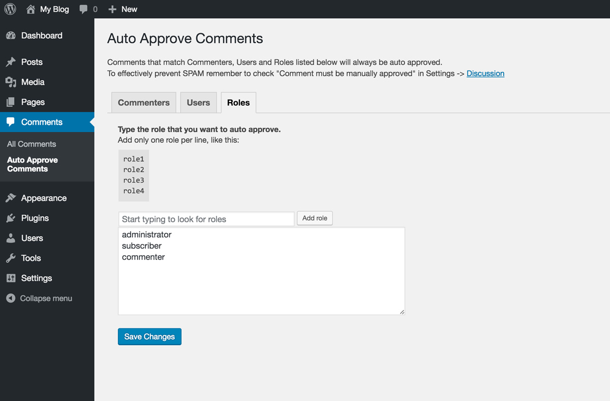

# Auto Approve Comments - WordPress Plugin

## Official URL
Download it from the WordPress plugin directory:  
https://wordpress.org/plugins/auto-approve-comments/


## Description
Auto approve comments by Commenter (email, name, url), User and Role. 
  
It has been tested and works well with Akismet and wpDiscuz.

## Installation
Upload the zip file on your WordPress website and activate the plugin.

## Usage
* Open Comments -> Auto Approve Comments
* Go to Settings -> Discussion and check "Comment must be manually approved" 
* Optionally install and activate Akismet (comments flagged as SPAM will never get auto approved) 
* Configure your auto approval filters in "Commenters", "Users" and "Roles"
* Save and you're done

From now on all the comments that match at least one of the configurations in "Commenters", "Users" or "Roles" will always be auto approved.

## Valid configurations

### Commenters
Add one Commenter per line, follow the example below:  
```
tom@myface.com
tom@myface.com,Tom
tom@myface.com,www.myface.com
tom@myface.com,www.myface.com,Tom
tom@myface.com,Tom,www.myface.com
```

### Users
Add one Username per line, follow the example below:  
```
steveknobs76
marissabuyer012
larrymage98
marktuckerberg2004
```

### Roles
Add one Role per line, follow the example below:  
```
contributor
editor
yourcustomrole
subscriber
```

## Interface screenshots

### Commenters tab  


### Users tab  


### Roles tab  



## License
The Auto Approve Comments plugin is licensed under the GPL v2 or later:  
http://www.gnu.org/licenses/gpl-2.0.html

